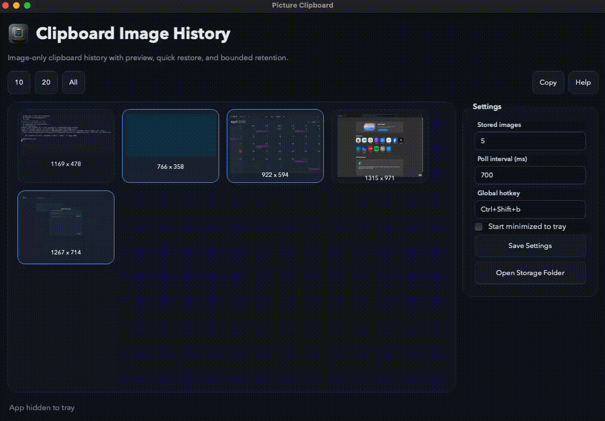

# Picture Clipboard

Picture Clipboard is a cross-platform Python desktop app for image-only clipboard history. It watches the system clipboard, keeps a bounded history of copied images, shows previews, and lets you copy a previous image back to the clipboard.



## Features

- Image-only capture. Text and files are ignored.
- Preview grid with quick restore back to the clipboard.
- Quick preview annotation with rectangular highlight, pen, erase, clear, and save-as-new-copy.
- Keep the latest `5` images by default, with a quick `10` image option.
- Tray-based app with a configurable global hotkey, defaulting to `Ctrl+Shift+V`.
- JSON-backed settings and file-backed PNG storage for low overhead and simple packaging.

## Keyboard Shortcuts & Navigation

- `h`, `j`, `k`, `l` or `Arrow Keys`: Move through saved image thumbnails
- `Space`: Open quick preview for the focused image
- `e` in preview: Toggle annotation tools
- `g` / `p` / `r` in edit preview: Choose highlight, pen, or erase
- `z` in edit preview: Undo the last annotation
- `c` in edit preview: Clear annotations
- `s` in edit preview: Save the annotated image as a new history item
- `Cmd+C`: Copy selected image(s) back to the clipboard
- `Click`: Toggle selection on an image (click again to deselect)
- `Cmd+A`: Select / Deselect all images
- `Esc`: Deselect all images
- `?`: Open the Help menu

## Run

```bash
uv sync
uv run python main.py
```

## App Logo

The app now looks for logo files in the repo `assets/` directory.

Expected filenames:

- `assets/pictureclip-logo.png`
- `assets/pictureclip-logo.icns`
- `assets/pictureclip-logo.ico`

Use your provided logo image as the source artwork and export those files before packaging. During development the app will load `assets/pictureclip-logo.png` automatically if it exists.

## Build Binaries

PyInstaller builds must be created on the target operating system. In practice:

- Build the macOS binary on macOS.
- Build the Linux binary on Linux.
- Build the Windows binary on Windows.

Cross-compiling GUI binaries with PyInstaller is not the practical path here.

Install dependencies first:

```bash
uv sync --all-groups
```

### macOS `.app`

Make sure `assets/pictureclip-logo.icns` exists, then run:

```bash
uv run pyinstaller \
  --name PictureClipboard \
  --windowed \
  --noconfirm \
  --icon assets/pictureclip-logo.icns \
  --add-data "assets/pictureclip-logo.png:assets" \
  main.py
```

Output:

- `dist/PictureClipboard.app`

### Linux binary

Make sure `assets/pictureclip-logo.png` exists, then run:

```bash
uv run pyinstaller \
  --name PictureClipboard \
  --windowed \
  --noconfirm \
  --icon assets/pictureclip-logo.png \
  --add-data "assets/pictureclip-logo.png:assets" \
  main.py
```

Output:

- `dist/PictureClipboard/` for one-folder output

### Windows `.exe`

Make sure `assets/pictureclip-logo.ico` exists, then run:

```powershell
uv run pyinstaller `
  --name PictureClipboard `
  --windowed `
  --noconfirm `
  --icon assets/pictureclip-logo.ico `
  --add-data "assets/pictureclip-logo.png;assets" `
  main.py
```

Output:

- `dist/PictureClipboard/`

If you want a single-file Windows executable instead, add `--onefile`, but startup will be slower.

if we want to remove the preious build and make the build again

```bash
rm -rf build/ dist/ && .venv/bin/pyinstaller PictureClipboard.spec --noconfirm
```

## Release Notes

After building, test these on the target OS:

- tray icon visibility
- global hotkey registration
- clipboard image detection
- app window show/hide behavior
- restoring an image back to the clipboard

## Notes

- The app stores images under the platform app-data directory used by Qt.
- **macOS Global Hotkeys**: Global hotkeys require **Accessibility** and **Input Monitoring** permissions on macOS. If your global hotkey stops working on a fresh build, or you rebuild the `.app` bundle from `./build.sh` and overwrite the older version in `/Applications`, macOS will see the new application signature and silently revoke permissions without prompting you again! Go to _System Settings -> Privacy & Security -> Accessibility_ (and also _Input Monitoring_), remove `PictureClipboard` using the minus (`-`) button, and relaunch the app to be prompted again.
- You can now select and copy multiple images simultaneously. The paths to multiple images are copied via `text/uri-list`, allowing bulk pasting into Finder, file explorers, and messaging applications.
